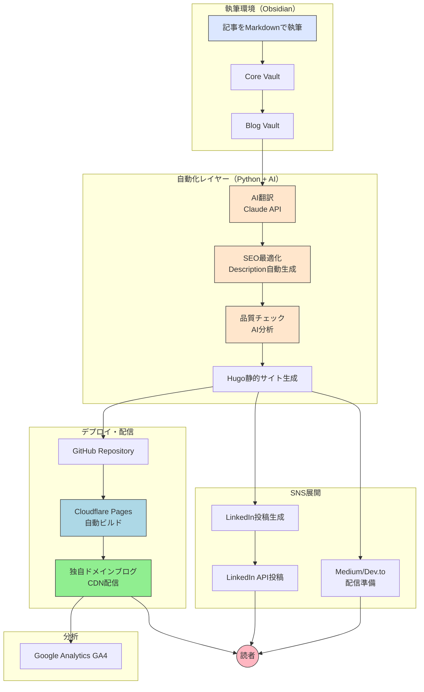

## はじめに：なぜこのシステムを作ったのか

私は入社して9年間、AD/ADAS領域のエンジニアとして仕事をしてきました。専門性は蓄積されたものの、社外からは見えなかったり、グローバル市場での評価はゼロといったことをキャリアとしてリスクに感じていました。

**専門性は、見えなければ存在しないのと同じです。**

そして気づきました。**発信しなければ、何も変わらない。**

とはいえ、以下のような課題がありました：

- **時間がない**: 本業があり、ブログに週10時間も割けません
- **継続が困難**: 手動での投稿作業が面倒で、すぐに挫折してしまいます
- **グローバル発信**: 日本語だけでは限界があり、英語での発信も必要です

そこで本記事では、私が構築した**年間$10.18で運用できるバイリンガル対応の自動ブログ投稿システム**について紹介します。

---
## このシステムで実現できること

### 主要機能

記事執筆（Obsidian） → ボタン1つ → 世界に配信

具体的には：
- 日本語で執筆 → AI翻訳で英語版も自動生成
- SEO最適化を自動実行
- 独自ドメインブログに自動公開
- LinkedIn投稿を自動生成
- Medium、Dev.to等への配信準備
- Google Analytics自動追跡

所要時間: 記事執筆以外は最終的には5分以内
年間コスト: $10.18（ドメイン代のみ）

### 解決した課題

#### Before（システム構築前）

記事1本の公開に3時間:
- Obsidianで執筆: 2時間
- 手動でHTML変換: 20分
- 画像最適化: 15分
- SEO設定: 15分
- GitHubにプッシュ: 10分
- デプロイ確認: 10分
- LinkedIn投稿作成: 30分
- 英語翻訳: 1時間（外注 or 自力）

**合計: 4-5時間**
→ 週2本公開は不可能
→ 挫折

#### After（システム構築後）

記事1本の公開に1時間:
- Obsidianで執筆: 50分
- 自動化スクリプト実行: 5分
  → AI翻訳
  → SEO最適化
  → 画像最適化
  → GitHub自動プッシュ
  → Cloudflare自動デプロイ
  → LinkedIn投稿自動生成
- 最終確認: 5分

**合計: 1時間**
→ 週2本公開が可能 
→ 継続できる 

---

## システムアーキテクチャ

### 全体構成図



---

### 技術スタック

| カテゴリ        | 技術               | 役割                     | コスト        |
| ----------- | ---------------- | ---------------------- | ---------- |
| **執筆**      | Obsidian         | Markdown記事作成、知的生産の核    | 無料         |
| **SSG**     | Hugo             | 静的サイト生成（Markdown→HTML） | 無料         |
| **AI**      | Claude API       | 翻訳・品質チェック・SEO最適化       | $5-10/月    |
| **ホスティング**  | Cloudflare Pages | 自動デプロイ・CDN配信           | 無料         |
| **バージョン管理** | GitHub           | ソース管理・CI/CD            | 無料         |
| **ドメイン**    | NameCheap        | 独自ドメイン                 | $10.18/年 ✅ |
| **DNS**     | Cloudflare       | DNS管理・メール転送            | 無料         |
| **SNS API** | LinkedIn API     | 自動投稿                   | 無料         |
| **分析**      | Google Analytics | アクセス追跡                 | 無料         |

**年間コスト合計: $10.18 + API利用料 $60-120 = $70.18-130.18（約1万円）**

---

## 実装の核心：5つのステージ

### ステージ１: 下書き（Draft）

**目的**: ローカルで記事を確認・修正します

```bash
draft.bat

draft_translate.bat
```

**実行内容**:
1. Obsidian（Core Vault）から記事を取得します
2. Hugo形式に自動変換します
3. `draft: true` で保存（非公開）します
4. Hugoサーバーを自動起動します
5. ブラウザで `http://localhost:1313` を開きます

**この時点では**:
- GitHubにプッシュしません
- 何度でも修正・プレビュー可能です
- 完全にローカルで完結します

**AI翻訳機能**:
```python
def translate_with_claude(japanese_text):
    """Claude APIで日本語→英語翻訳"""
    prompt = f"""
    以下の技術記事を英語に翻訳してください。
    - 専門用語は適切に
    - 読みやすく自然な英語で
    - Markdown形式を保持
    
    {japanese_text}
    """
    # Claude API呼び出し
    response = call_claude_api(prompt)
    return response
```

### ステージ２: 品質チェック（Check）

**目的**: AI による記事品質分析を行います

```bash
check.bat
```

**チェック項目**:
- 主語の省略検出（日本語特有の問題）
- 論理の飛躍検出
- 抽象→具体の対応
- 曖昧表現の検出
- 技術用語の正確性
- SEO観点での改善提案

**出力例**:
```markdown

## 主語の省略（3箇所）
- Line 45: "システムを構築した" → 誰が？
  提案: "私はシステムを構築した"

## 論理の飛躍（2箇所）
- Line 78-82: 手順2から手順3への飛躍
  提案: 中間ステップを追加

## 曖昧表現（5箇所）
- Line 92: "かなり速い" → 具体的な数値は？
  提案: "3倍速い（7h → 2h）"

## 総合評価: 85/100
改善すると: 90/100
```

### ステージ３: 公開前最適化（Pre-Publish）

**目的**: SEO最適化・Description自動生成を行います

```bash
```

**実行内容**:

**1. Description自動生成（Claude API）**
```python
def generate_description(article_text):
    """SEO最適化された要約を自動生成"""
    prompt = f"""
    以下の記事から、SEO最適化された要約を生成してください。
    
    要件:
    - 120-160文字
    - キーワードを自然に含める
    - 読者の興味を引く
    - 記事の核心を伝える
    
    {article_text}
    """
    description = call_claude_api(prompt)
    return description
```

**2. SEO自動チェック**
```python
seo_checks = {
    'title_length': 60文字以内か？,
    'h1_exists': H1タグがあるか？,
    'description': 120-160文字か？,
    'images': alt属性があるか？,
    'word_count': 最低1,500語あるか？,
    'tags': 3-5個のタグがあるか？,
    'internal_links': 内部リンクがあるか？
}
```

**3. H1の扱い（重要）**
```markdown
問題: HugoテーマがタイトルをH1で出力
     → Markdown内のH1と重複
     → SEO的にNG

解決策: 
1. Markdown内のH1をコメントアウト
2. CSSで非表示
3. でもHTMLには残す（SEO用）
```

### ステージ４: 公開（Publish）

**目的**: 記事を実際に公開します

```bash
publish.bat
```

**実行フロー**:
```python
def publish_workflow():
    # 1. Description自動生成
    description = generate_description(article)
    
    # 2. SEO自動チェック
    seo_result = check_seo(article)
    if not seo_result.passed:
        print("SEO問題あり:", seo_result.issues)
        if not confirm("それでも公開？"):
            return
    
    # 3. Hugo形式に変換（draft: false）
    convert_to_hugo(article, draft=False)
    
    # 4. 日本語版と英語版を保存
    save_bilingual_articles(article_ja, article_en)
    
    # 5. Git自動プッシュ
    git_push_with_message(f"Publish: {article.title}")
    
    # 6. LinkedIn投稿生成
    generate_linkedin_posts(article)
    
    print("✅ 公開完了！")
    print(f"日本語: https://takuyaniioka.com/ja/posts/{slug}/")
    print(f"英語: https://takuyaniioka.com/posts/{slug}/")
```

**公開後の自動デプロイ**:
```
GitHub Push
    ↓ (Webhook)
Cloudflare Pages検知
    ↓
Hugo自動ビルド（約30秒）
    ↓
CDN配信
    ↓
ブログ公開 
```

### ステージ５: SNS展開（LinkedIn）

**目的**: 記事からLinkedIn投稿を自動生成します

```bash
linkedin_post.bat
```

このシステムでは、記事から自動的にLinkedIn投稿を生成することができます。必要に応じて手動で編集・投稿することも可能な設計に今後修正していく予定です。

### ステージ６: アクセス分析（Analytics）

**Google Analytics GA4統合**:

```toml
[params]
  googleAnalytics = "G-XXXXXXXXXX"
```

**追跡データ**:
- リアルタイムアクセス
- 流入元（LinkedIn, Medium, Google等）
- 人気記事ランキング
- デバイス・地域別統計
- 滞在時間・直帰率


## 設計思想：なぜこの構成なのか

### 1. Obsidian中心主義

**理由**:
- **Second Brain**: 私の知的生産の核です
- **一元管理**: 記事も、メモも、すべてObsidianで管理します
- **思考の断絶を防ぐ**: 情報を分散させません

**構成**:
```
Obsidian/
├── Core Vault/          # プライベート・知的生産
│   ├── Daily Notes/
│   ├── Projects/
│   └── Articles/        # 記事の下書き
│
└── Blog Vault/          # パブリック・ブログ専用
    ├── content/
    ├── static/
    └── config.toml
```

**分離の理由**:
- Core Vaultは非公開（個人的なメモ・機密情報）です
- Blog Vaultは公開（GitHubにプッシュ）します
- 明確な境界線を設けています


### 2. AI活用の哲学

**AIは「代替」ではなく「拡張」です**

```
【間違った使い方】
全てAIに書かせる
→ 独自性ゼロ
→ 価値ゼロ

【正しい使い方】
人間: 核となる洞察・経験を書く
AI: 翻訳・SEO・品質チェックを自動化

→ 人間は知的生産に集中
→ AIは反復作業を処理
```

**具体例**:
- ✅ AI翻訳: 日本語で深く考え、AIが英語化
- ✅ SEO最適化: AIがDescription自動生成
- ✅ 品質チェック: AIが客観的にレビュー
- ❌ 記事執筆: 人間が書く（AIは補助のみ）


### 3. 段階的処理（Staged Workflow）

#### なぜ5ステージに分けたか:

**理由1: 安全性**
- 一度に公開せず、段階的に確認
- 各ステージで問題を発見・修正

**理由2: 柔軟性**
- 途中で止められる
- 任意のステージから再開可能

**理由3: デバッグ性**
- どこで問題が起きたか明確
- ログを見れば一目瞭然

## 実装の詳細：コア機能

### 機能1: 記事フォーマット変換

**課題**:
- Obsidian形式（EvolutionVault）
- Hugo形式（BlogVault）
- 形式が異なる

**解決**:
```python
def convert_evolution_to_hugo_format(source_file, draft_mode=True):
    """EvolutionVault形式 → Hugo形式"""
    
    # 1. YAML frontmatterを解析
    with open(source_file, 'r', encoding='utf-8') as f:
        content = f.read()
    
    # frontmatterと本文を分離
    if content.startswith('---'):
        parts = content.split('---', 2)
        frontmatter = parts[1]
        body = parts[2] if len(parts) > 2 else ""
    
    # 2. Hugo用に変換
    hugo_frontmatter = convert_frontmatter(frontmatter)
    hugo_frontmatter['draft'] = draft_mode
    
    # 3. 保存
    output_path = get_hugo_path(source_file)
    save_hugo_file(output_path, hugo_frontmatter, body)
```


### 機能2: SEO自動最適化

**課題**:
- Descriptionを毎回手動で書くのは大変
- SEOチェックが漏れやすい

**解決**:
```python
def optimize_seo(article):
    """SEO自動最適化"""
    
    # 1. Description自動生成（Claude API）
    description = generate_description_with_ai(article.content)
    article.description = description
    
    # 2. SEOチェックリスト
    checks = [
        check_title_length(article.title),
        check_description_length(article.description),
        check_h1_tag(article.content),
        check_image_alt_tags(article.content),
        check_word_count(article.content),
        check_tags(article.tags),
        check_internal_links(article.content)
    ]
    
    # 3. 問題があれば警告
    issues = [c for c in checks if not c.passed]
    if issues:
        print("⚠️ SEO問題:")
        for issue in issues:
            print(f"  - {issue.message}")
    
    return article
```


### 機能3: バイリンガル対応

**課題**:
- 日本語と英語を別々に管理すると複雑
- URLもそれぞれ必要

**解決**:
```
Hugo多言語機能を活用:

日本語:
https://takuyaniioka.com/ja/posts/article-slug/

英語:
https://takuyaniioka.com/posts/article-slug/

自動切り替え:
- ブラウザ言語設定を検知します
- 日本語ブラウザ → /ja/
- 英語ブラウザ → /
```

**実装**:
```toml
[languages]
  [languages.en]
    languageName = "English"
    weight = 1
    contentDir = "content"
    
  [languages.ja]
    languageName = "日本語"
    weight = 2
    contentDir = "content"
    
[params]
  defaultContentLanguage = "en"
  defaultContentLanguageInSubdir = false
```

## 成果：このシステムがもたらしたもの

### 定量的成果

| 指標        | Before          | After                | 改善    |
| --------- | --------------- | -------------------- | ----- |
| **執筆効率**  | 5時間/記事          | 1時間/記事               | 5倍速   |
| **週次投稿数** | 0-1本            | 2本                   | 2倍+   |
| **年間記事数** | 10-20本（挫折込み）    | 60本以上（目標達成可能）        | 3-6倍  |
| **コスト**   | 外注翻訳 $50-100/記事 | $10.18/年 + API $10/月 | 95%削減 |

## 本システムの構築の仕方

### 構築ステップ（概要）

**Step 1: 環境準備（1時間）**
1. Obsidian をインストール
2. Hugo をインストール
3. Git をインストール
4. Python をインストール
5. GitHub アカウントを作成
6. Cloudflare アカウントを作成

**Step 2: ドメイン取得（15分）**
1. NameCheapで独自ドメインを取得（$10.18/年）
2. CloudflareでDNS設定
3. メール転送設定（オプション）

**Step 3: Hugo設定（30分）**
1. Hugoサイトを作成
2. テーマを選択（Hugo Clarity推奨）
3. config.tomlを設定
4. バイリンガル設定

**Step 4: Cloudflare Pages設定（15分）**
1. GitHubリポジトリを作成
2. Cloudflare Pagesにリンク
3. ビルド設定（Hugo）
4. カスタムドメイン設定

**Step 5: 自動化スクリプト設定（1時間）**
1. Python依存関係をインストール
2. 自動化スクリプトを配置
3. .batファイルを作成
4. Claude APIを設定
5. テスト実行

**Step 6: 初回記事公開（30分）**
1. Obsidianで記事を執筆
2. draft.batを実行
3. プレビュー確認
4. publish.batを実行
5. 公開完了

**総所要時間: 約4時間**

## まとめ：このシステムの本質

- 時間短縮: 5時間 → 1時間
- コスト削減: 95%削減
- 多言語対応: 日英自動
- SNS展開: 自動化

## リソース

### 参考リンク

- [Hugo公式ドキュメント](https://gohugo.io/)
- [Cloudflare Pages](https://pages.cloudflare.com/)
- [Claude API](https://www.anthropic.com/api)
- [LinkedIn API](https://learn.microsoft.com/en-us/linkedin/)
- [Obsidian](https://obsidian.md/)

### GitHubリポジトリ

現在は公開していませんが、問い合わせ次第では公開も前向きに検討したいと考えています。内容としては下記のような構成を想定しています。

- 自動化スクリプト
- セットアップガイド
- トラブルシューティング
- FAQ